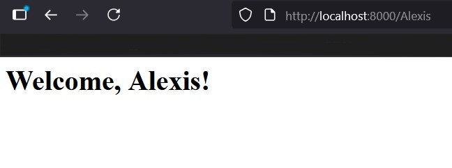

<h1>Express Web Application</h1>
<h2>How It's Made:</h2>

[![HTML5][HTML5-shield]][HTML5-url]
[![JavaScript][JavaScript-shield]][JavaScript-url]
[![Node.js][NodeJS-shield]][NodeJS-url]
[![Express.js][Express-shield]][Express-url]

[HTML5-shield]: https://img.shields.io/badge/HTML5-E34F26?style=for-the-badge&logo=html5&logoColor=white
[HTML5-url]: https://developer.mozilla.org/en-US/docs/Glossary/HTML5

[Express-shield]: https://img.shields.io/badge/Express.js-000000?style=for-the-badge&logo=express&logoColor=white
[Express-url]: https://expressjs.com/
[JavaScript-shield]: https://img.shields.io/badge/JavaScript-F7DF1E?style=for-the-badge&logo=javascript&logoColor=black
[JavaScript-url]: https://developer.mozilla.org/en-US/docs/Web/JavaScript

[NodeJS-shield]: https://img.shields.io/badge/Node.js-339933?style=for-the-badge&logo=nodedotjs&logoColor=white
[NodeJS-url]: https://nodejs.org/

<h2>Overview</h2>
This project is a simple Node.js web server built using the Express framework. It recreates the “Simple Server” from previous labs but utilises the Express module.
Additional routes have been added, and the app has been deployed to a virtual machine for production to run forever.

<h2>What is Express?</h2>
Express is a lightweight and flexible Node.js framework used to build web applications and APIs. It simplifies server creation compared to the raw Node.js http module and allows for modular code organization using middleware and routing.

<h2>Installation</h2>
<h4>1. Clone Repository</h4>
git clone https://github.com/<your-username>/04_express_12345678.git
cd 04_express_12345678
<h4>2. Install Dependencies</h4>
npm install
<h4>3. Run the Application</h4>
node index.js
<h4>4. Open your browser and visit</h4>
http://localhost:8000

<h2>Routes</h2>

| Route | Description | Example Output |
|--------|--------------|----------------|
| `/` | Default home route that displays a “Hello World!” message. | `<h1>Hello World!</h1>` |
| `/about` | Displays an About page. | `<h1>This is the about page</h1>` |
| `/contact` | Displays your contact details. | `<h1>Contact Page: axavi001@campus.goldsmiths.ac.uk</h1>` |
| `/date` | Shows the current date and time using JavaScript’s `Date()` object. | `Thu Oct 23 2025 20:15:43 GMT+0000 (Greenwich Mean Time)` |
| `/:username` | Dynamic route that greets the user by name. | `/alex` → `<h1>Welcome, alex!</h1>` |
| `/chain` | Demonstrates middleware chaining — the first function sets a custom message, and the second sends it as a response. | `<h1>Second function runs — response sent!</h1>
Hello from the first handler!
` |
| `/file` | Sends the `a.html` file stored in the project directory using `res.sendFile()`. | Displays the contents of `a.html`. |

<h2>Custom User Page</h2>

If you input into the link, http://localhost:8000/USER
(USER = any name youd like), you will get a custom output

<h2>Final Result Page</h2>

